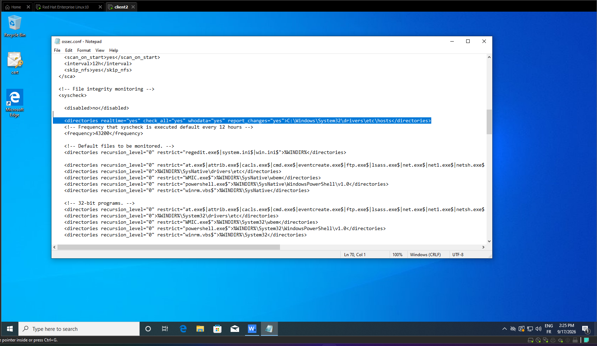
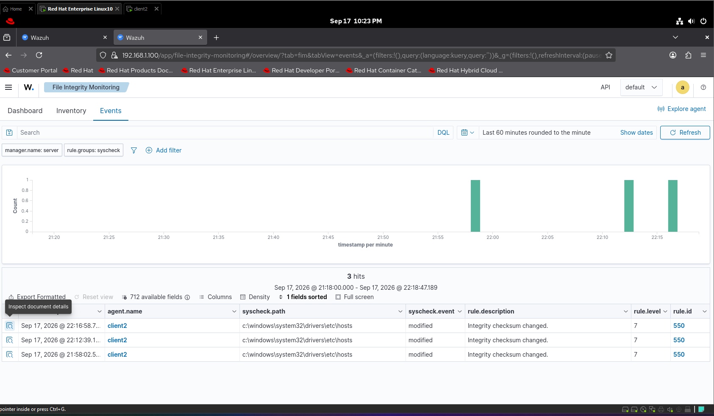

# 🛡️ Real-Time File Integrity Monitoring (FIM) & SOC Incident Detection with Wazuh SIEM


The goal is to monitor critical system files in real-time, detect unauthorized configuration changes (specifically DNS spoofing/redirection attempts via the Windows hosts file), and audit user and process activity for threat response.

---

## 🏗️ Architecture & Lab Setup
- SIEM Manager: Wazuh Server (Red Hat Enterprise Linux 10) - 192.168.1.100
- Monitored Endpoint: Windows Client (client2) running Wazuh Agent v4.14.7
- Target File: C:\Windows\System32\drivers\etc\hosts
- Monitoring Mode: Real-time + Whodata Audit Engine enabled

---

## ⚙️ Configuration Steps

### 1. Agent Configuration (ossec.conf)
To enable real-time detection, process tracking, and line diff reporting, the syscheck module in ossec.conf was configured as follows:

```xml
<syscheck>
  <disabled>no</disabled>
  <directories realtime="yes" check_all="yes" whodata="yes" report_changes="yes">C:\Windows\System32\drivers\etc\hosts</directories>
</syscheck>
```

### 2.Service Restart 
after applying the XML configurations , restart the agent service to apply changes.





### ⚔️ Attack Simulation & Threat Detection

​    1. Simulated Malicious Activity:

​An unauthorized modification was introduced to the Windows hosts file using notepad.exe under user account client.
​A fake DNS entry redirecting domain traffic was appended:
192.168.1.111 malicious-domain.com
​    2. Real-time Alerting:
​Wazuh captured the file event instantly upon file save (Ctrl + S), triggering Rule ID 550 (Integrity checksum changed).
### ​📊 Detection & Forensic Evidence

​# 🔍 Forensic Document Details
​The Wazuh Manager captured detailed metadata identifying the root cause and modification diff:


/test.png)
